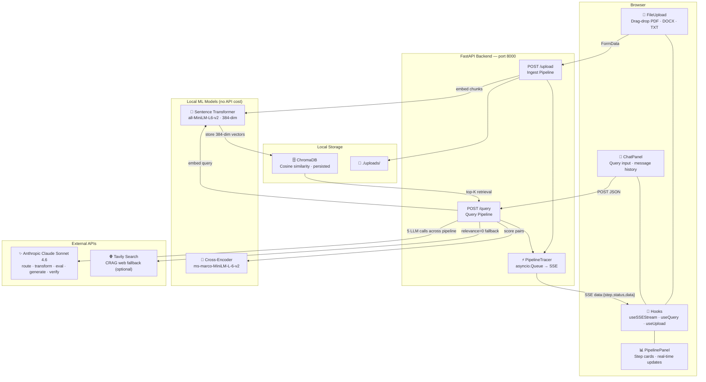

# RAG VIZ — Explainable RAG System Visualizer

A full-stack application that makes Retrieval-Augmented Generation (RAG) transparent. Upload a document, ask a question, and watch every step of the pipeline execute in real-time — from query routing and retrieval to re-ranking, context building, generation, and verification.

Built as a learning tool to understand how modern RAG systems actually work under the hood.

---

## What It Does

Most RAG applications hide everything behind a single API call. RAG VIZ exposes each step as it happens:

- **Route** — classifies your query into one of 5 retrieval strategies
- **Transform** — rewrites or expands your query using the chosen strategy
- **Retrieve** — embeds and searches the vector store per transformed query
- **Re-rank** — scores retrieved chunks with a cross-encoder model
- **Evaluate** — judges chunk relevance (CRAG) and decides whether to web search
- **Web Search** — conditionally fetches live results via Tavily
- **Build Context** — assembles the prompt with token-budget tracking per chunk
- **Generate** — calls Claude to produce an answer
- **Verify** — checks faithfulness and relevance, retries if issues are found

Each step streams results to the UI as soon as it completes.

---

## Demo

![Pipeline visualization showing each RAG step expanding in real-time]

> Upload a PDF → ask a question → watch the 9-step pipeline unfold

---

## Tech Stack

| Layer | Technology |
|-------|-----------|
| Frontend | React 18, TypeScript, Vite, TailwindCSS |
| Backend | FastAPI, Python, Server-Sent Events |
| Embeddings | `sentence-transformers/all-MiniLM-L6-v2` (384-dim, local) |
| Re-ranking | `cross-encoder/ms-marco-MiniLM-L-6-v2` (local) |
| Vector Store | ChromaDB (persisted locally) |
| LLM | Claude Sonnet 4.6 (Anthropic API) |
| Web Search | Tavily API (optional) |
| Doc Parsing | LangChain + pypdf + docx2txt |

---

## Project Structure

```
RAG_VIZ/
├── backend/
│   ├── main.py                  # FastAPI app
│   ├── config.py                # Chunk size, top-k, model names
│   ├── requirements.txt
│   ├── api/
│   │   ├── ingest.py            # POST /upload
│   │   └── query.py             # POST /query (SSE stream)
│   └── pipeline/
│       ├── tracer.py            # Central async event bus
│       ├── ingest/              # load → chunk → embed → store
│       └── query/               # route → transform → retrieve → rerank
│                                # → evaluate → websearch → context → generate → verify
├── frontend/
│   └── src/
│       ├── components/
│       │   ├── ChatPanel/       # Chat input, file upload, message history
│       │   └── PipelinePanel/   # Step cards with real-time updates
│       ├── hooks/               # useQuery, useUpload, useSSEStream
│       └── types/pipeline.ts    # TypeScript types for all step data
├── .env.example
└── README.md
```

---

## System Architecture



## Getting Started

### Prerequisites

- Python 3.9+
- Node.js 18+
- An [Anthropic API key](https://console.anthropic.com/)
- *(Optional)* A [Tavily API key](https://tavily.com/) for web search fallback

### 1. Clone and configure

```bash
git clone https://github.com/Tejaswini2112/RAG_VIZ.git
cd RAG_VIZ

cp .env.example .env
# Edit .env and add your ANTHROPIC_API_KEY (and optionally TAVILY_API_KEY)
```

### 2. Start the backend

```bash
cd backend
python -m venv .venv
source .venv/bin/activate        # Windows: .venv\Scripts\activate
pip install -r requirements.txt
uvicorn main:app --reload --host 0.0.0.0 --port 8000
```

The first run downloads the embedding and re-ranking models (~100 MB total). Subsequent starts are fast.

### 3. Start the frontend

```bash
cd frontend
npm install
npm run dev
```

Open [http://localhost:5173](http://localhost:5173).

---

## Usage

1. **Upload a document** — drag and drop or click to upload a PDF, DOCX, or TXT file. The ingestion panel shows chunking and embedding progress.
2. **Ask a question** — type any question about the document content.
3. **Watch the pipeline** — each step card expands as it runs, showing intermediate data like retrieved chunks, re-ranking scores, token counts, and the final generated answer.
4. **Stop anytime** — click the stop button to cancel an in-flight request.

### Retrieval Strategies

The router picks one of five strategies based on your query type:

| Strategy | When Used | What It Does |
|----------|-----------|--------------|
| `none` | Simple factual queries | Uses the original query as-is |
| `multi_query` | Ambiguous questions | Generates 3 alternative phrasings |
| `decomposition` | Complex multi-part questions | Breaks into 2–4 sub-questions |
| `hyde` | Abstract or conceptual queries | Generates a hypothetical answer to search with |
| `step_back` | Specific detail questions | Generates a broader context query first |

---

## Configuration

Key settings in [backend/config.py](backend/config.py):

```python
CHUNK_SIZE = 500           # characters per chunk
CHUNK_OVERLAP = 50         # overlap between adjacent chunks
TOP_K = 5                  # chunks retrieved per query
MAX_CONTEXT_TOKENS = 2000  # token budget for the prompt context window
CLAUDE_MODEL = "claude-sonnet-4-6"
EMBEDDING_MODEL = "all-MiniLM-L6-v2"
RERANK_MODEL = "cross-encoder/ms-marco-MiniLM-L-6-v2"
```

---

## How the Streaming Works

The backend uses **Server-Sent Events (SSE)** to push pipeline progress to the browser as each step finishes. A central `PipelineTracer` (asyncio queue) collects events from pipeline steps running in thread pool executors and serializes them to the SSE stream. The frontend processes each event and updates the corresponding step card without polling.

---

## Supported File Types

| Format | Parser |
|--------|--------|
| `.pdf` | pypdf via LangChain |
| `.docx` | docx2txt via LangChain |
| `.txt` | Plain text loader |

---

